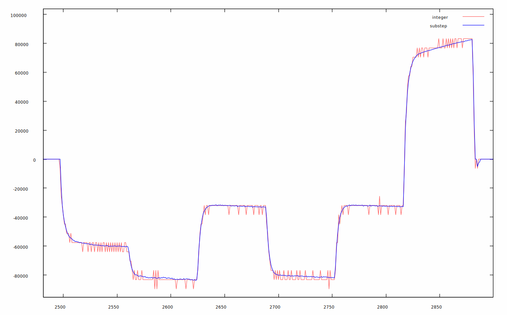
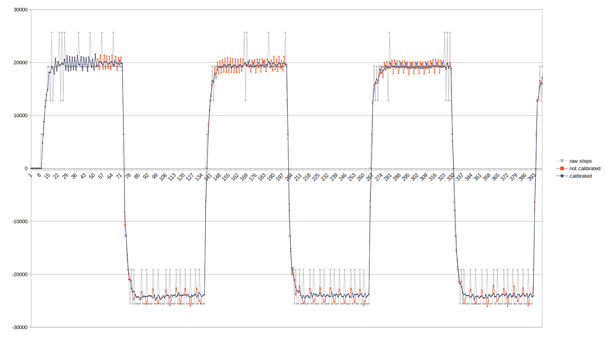
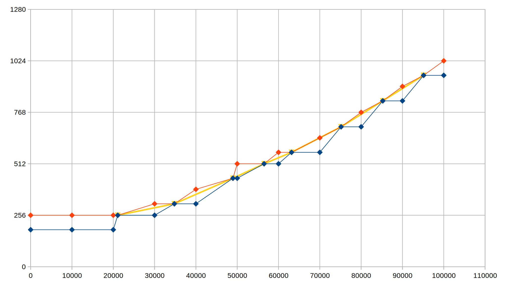

# Sub-Step Quadrature Encoder

## The problem

Hardware peripherals to read quadrature encoders count steps by looking at the sequence of phase states read from a quadrature encoder.

To estimate the encoder speed, the user can check how many steps were counted over a period of time. For instance, if the count was 120 at some point and was 134 10ms later, we can estimate that the speed is 14 steps in 10ms or 1400 steps per second.

This works relatively well for high counts, but at low speeds (or high sample rates), the quantization effect of looking at integer counts can introduce a high level of quantization noise in the speed measurement.

A different approach that would work better at low speeds, would be to measure the time it takes to advance one step and use its inverse to compute the speed. For instance, if one step takes 540us, then the speed is 1/0.000540 = ~1852 steps per second.

Unfortunately, as speed increases the resolution of this method decreases rapidly. At 100.000 steps per second, a step takes 10us. Measuring 9, 10 or 11 us per step will give speeds of 111k, 100k or 90k steps per second, respectively. 

Moreover, especially in low cost encoders, the phases are not all the same size which introduces another source of measurement noise if not compensated properly. 

## The Solution

The "sub-step" quadrature encoder code solves this problem by using an hybrid approach: the PIO code keeps track of the integer step count, but also how long ago was the last transition and the direction of that transition. The high level code can then use that information to compute a speed estimate that doesn't suffer from the integer quantization problem of just counting steps and can support high step rates as well.

The high level code also takes into account and compensates the phase size differences of the encoder.

The chart below shows the speed estimate using just integer step counts in red and the sub-step speed estimate in blue for an encoder connected to a DC motor doing some voltage step changes.

Note that unlike what we would get by doing a low-pass filter on the integer count signal, the sub-step version has no delay and does not limit the frequency response of the encoder.

## Usage

Start by declaring a PicoEncoder instance:

`PicoEncoder encoder;`

Call the begin method to initialize the encoder instance and start counting steps:

`encoder.begin(phaseAPin);`

The two phases of the encoder must be connected to consecutive pins and the parameter is the lowest numbered pin using arduino naming. Note that the pins must be consecutive in the RP2040 and may not correspond to consecutive numbers in the arduino mapping.

For instance, on the Arduino Nano RP2040 board, pins D2 and D3 are GPIO25 and GPIO15, so they can not be used for this purpose. However, pin D4 is GPIO16, which means pins D3 and D4 could be used to connect the encoder by passing pin D3 to `begin` (actually all pins from D3 to D9 are consecutive on that board).

The method also sets the pins as inputs and will turn on the pull-ups on the pins if the parameter "pullUp" is true (default value). Many encoders have open-collector outputs and require pull-ups. If unsure, leave the default value of true.

Returns 0 on success, -1 if there is no PIO available, -2 if there are too many encoder instances

The begin method allocates the necessary PIO resources. The PIO code uses all 32 instructions on the PIO, so it can not share the PIO with other PIO programs. However it can run up to 4 encoder instances in that PIO (and up to 8 in total using both PIO units on the RP2040).

To make a measurement call the `update` method. This will update the `position`, `speed` and `step` fields on the encoder instance:

  - `position` is given in "sub-steps". You can think of a sub-step as 1/64th of a step. For example, an encoder that advertises 100 steps per revolution, will actually have 100 full cycles per revolution, so 400 steps in this context and the position field will go up by 400 * 64 = 25600 in a single revolution. The position field is useful in situations where the encoder is measuring something that doesn't accumulate indefinitely, like the position of a 3D printer head. There is a `resetPosition` method that can be used to set the zero position according to an absolute external reference, like a limit switch. When `resetPosition` is called, the current position will become the new zero position

  - `speed` is given in "sub-steps per second". This is the most up to date speed estimate. Don't use differences in the position field to estimate speed as that will produce a worse estimate than to just read the speed field directly

  - `step` is the current position in steps, like what would be returned by a classical quadrature encoder hardware

For more details, see the SpeedMeasure example distributed with the library.

## Phase calibration

To increase the precision of the speed estimate, the user can run a calibration function to measure the relative sizes of the phases of the encoder. The sub-step code will then use this information to compensate the phase size differences while computing speed estimates. This is not strictly necessary, but if not done, the code will assume equal size phases, which will introduce noise, especially at low speeds.

Note that for an encoder to have perfectly balanced 90 degree phases, each individual phase would require a perfect 50% duty cycle and the phases would need to be exactly 90 degrees apart. That is almost never the case in low cost encoders.

The simplest way to do phase calibration is to just call `autoCalibratePhases` during the idle time of the main control loop (see the SpeedMeasure example). This method will look for encoder transitions, measure relative phase sizes and adjust the phase size calibration, all automatically.

The chart below shows the difference between an uncalibrated speed measure and a calibrated one (and the speed estimate we would get from raw steps only). Note that both versions are the same until around sample 53 when the auto calibration code has enough information to start compensating phase sizes.

The only downside of this method is that there will be a short period at system startup where the PicoEncoder won't have phase calibration information and will operate as if the phases have the same size. This is usually not a problem, but it can be avoided with a more complex sequence:
  - call `autoCalibrationDone` to check if the auto calibration process has already completed the phase size measurement. Continue running `autoCalibratePhases` until it does
  - when the auto calibration is done, call `getPhases` to get an integer representing the phase sizes. Save this number
  - on the initialization code, call `setPhases` passing the value saved previously. This will immediately set the phase calibration at init time and avoid the learning period. After calling `setPhases` there is no need to call `autoCalibratePhases` any more

If you are curious about how unbalanced your encoder is, the value returned by `getPhases` has one phase size per byte, so a value of 0x404040 would represent a perfect encoder (the fourth size is implied by being 256 minus the sum of the other three).

## Sub-step vs simple quadrature encoder

Compared with a simple step counting solution, this library has the advantage that it uses the information from the transition times to extract a much better speed and position estimate.

Like with an hardware encoder, it doesn't use CPU time while counting steps and it's only the update function that uses CPU time. Note that this function is called at the control frequency of your system, say 100Hz, and so the CPU time used is independent of the step rate of the encoder. To use as little CPU as possible, this function only uses integer arithmetic.

Note: the `PicoEncoder` class has a `step` field that contains the same step count that would have been returned by a simple quadrature encoder. This can be useful if, for instance, we have a project with a couple of DC motors with encoders (that would benefit from using the sub-step version), but also a rotary encoder for the user interface (for which we only need integer steps). 

## Implementation details

The chart below illustrates how the sub-step works. The horizontal scale is time in micro-seconds, the vertical step is in sub-steps. 4 hardware steps (one cycle) are always 256 sub-steps. To simplify, lets assume the phases are balanced and each step takes exactly 64 sub-steps.

The red line is the upper bound of the encoder position, whereas the blue line is the lower bound. The yellow line is the speed estimate.

At the start, the encoder is stopped at hardware step 3, so the sub-step position estimate is between 192 and 256.

At 30ms, we read the data from the PIO and there was a transition at ~21ms and the current integer step is 4. At the time of the transition the lower and upper bounds for the position touch, because we know exactly where the encoder is in that instant.

At this point we don't know much about the speed. The sub-step position of the encoder could have been close to 256 (close to the upper bound) and it could still be there now (close to the lower bound).

At 40ms, we read the PIO again. The encoder has made another step so we know the sub-step position is between 320 and 384. We also know there was a transition at ~34ms, so we can compute a speed estimate as the encoder did 64 sub-steps in 34 - 21 = 13ms (note: the actual code uses micro-seconds).

At 50ms, the encoder actually did 2 steps, the sub-step position is now between 448 and 512 and the last transition was at ~49ms. Note that there were two transitions in this period, but we only get the latest transition from the PIO code. This still allows us to compute a new speed estimate, as we made 128 sub-steps in 49 - 34 = 15 ms.

On top of using actual transitions to compute the speed, the current step position is also used to give a upper and lower bound on the speed so that the code can react faster to large variations in speed.

To compensate for unbalanced phase sizes, the sub-step position assigned to each hardware step transition is not a multiple of 64 but instead depends on the phase size calibration. The lower bound of phase 0 is always a multiple of 256, though.

